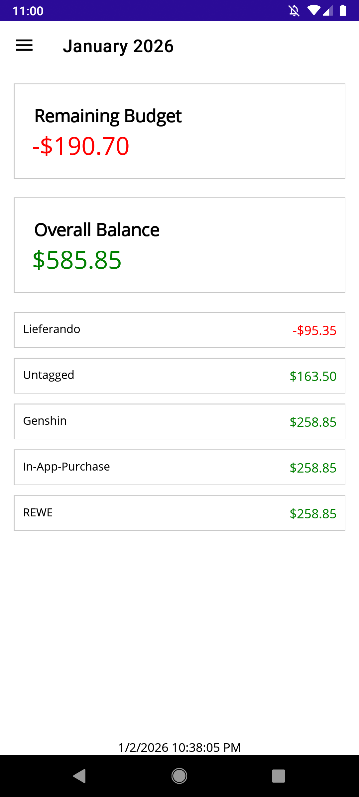
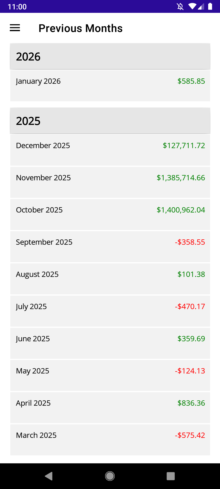

# Money Spending Tracker

A .NET MAUI Android application for tracking your spending and managing your monthly budget.  Money Spending Tracker automatically fetches your bank transactions, categorizes them using AI (or at least something like that), and helps you stay on top of your finances.

## Features

- **Monthly Budget Tracking** - Set your monthly budget and track spending.
- **Automatic Transaction Updates** - Automatically fetch transactions from your bank accounts
- **AI-Powered Tagging** - Transactions are automatically categorized by finding similar previously tagged transactions
- **Android Widgets** - View your budget and balance directly from your home screen without opening the app
- **Multi-Account Support** - Connect and manage multiple bank accounts
- **Secure & Private** - All data is stored locally in an encrypted SQLite database
- **Manual Tag Management** - Create custom tags and manually categorize transactions as needed

## Screenshots

 

## Requirements

### For Users
- Android 9 (API Level 28) or higher
- [GoCardless Bank Account Data](https://developer.gocardless.com/bank-account-data/overview/) API account (*)

*Registration no longer possible, you need to already have one.

### For Developers
- .NET 10 SDK
- Visual Studio 2022 (recommended) or Visual Studio Code
- Android SDK

## Technology Stack

- **.NET 10 MAUI** - Cross-platform UI framework
- **Entity Framework Core 10** - Database management
- **SQLite** - Local encrypted database
- **MAUI Community Toolkit** - MVVM helpers and utilities

## Setup

- Create new GoCardless Bank Account Data [user secrets](https://bankaccountdata.gocardless.com/user-secrets/) (or use existing ones)
- Install the app via APK (see releases)
- Follow app onboarding

## License

This project is licensed under the MIT License - see the [LICENSE](LICENSE) file for details.

## Contributing

Contributions are welcome! Please feel free to submit a Pull Request.
